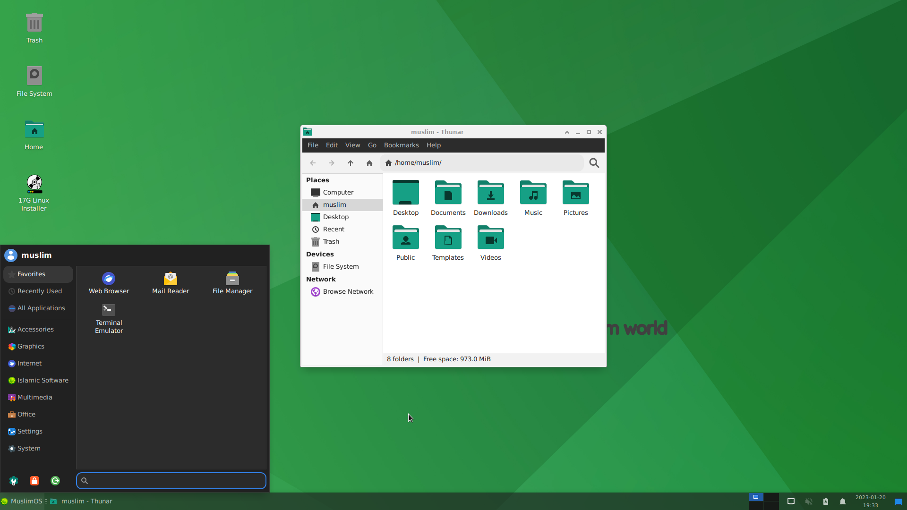

# Welcome to universe of Muslim Linux (Debian based) 

The Muslim Linux project aims to provide pure Linux experience by freeing Debian from bloats. Muslim Linux is based on Debian's installation with Deboostap and uses Debian testing repos. Muslim Linux is very easy to install and use. Made with Muslim Linux teaiso.

---

